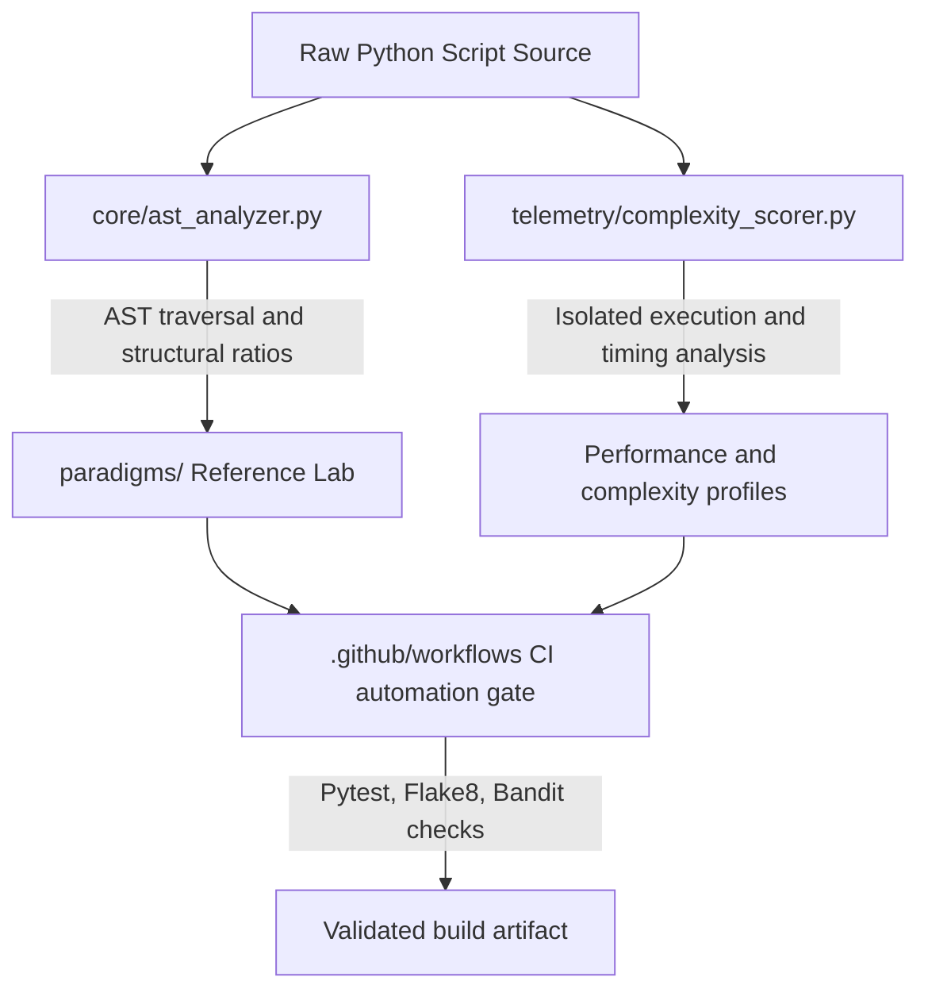

# Multi-Paradigm Evaluation, Refactoring, & Static Code Telemetry Engine (`teach-the-tech`)

[](https://github.com/daconjam/teach-the-tech/actions/workflows/ci.yml)

An automated evaluation, syntax analysis, and performance benchmarking infrastructure for Python code. This engine parses raw Python execution payloads, infers structural programming paradigms from AST features, orchestrates LLM-assisted refactoring workflows, and collects runtime telemetry across Procedural, Object-Oriented, and Functional styles.

Designed as a developer enablement platform and training simulator, this repository demonstrates production-oriented software engineering practices, strict typing contracts, and automated quality gates.

---

## System Architecture

The engine operates as a decoupled ingestion and analysis pipeline. Source payloads are evaluated through static syntax analysis and runtime execution profiling before passing through automated CI checks.



---

## Core Modules

### `core/ast_analyzer.py`
- Implements `ast.NodeVisitor` for structured abstract syntax tree traversal.
- Computes structural density ratios to help classify multi-paradigm source files.
- Captures `SyntaxError` conditions and records diagnostic details without interrupting the pipeline.

### `transformation_engine.py`
- Wraps vendor SDK clients for LLM-assisted code transformation workflows.
- Uses low-temperature settings to encourage stable refactoring outputs.
- Includes `sanitize_llm_response` to remove stray conversational text, markdown fences, and formatting noise before parsing.
- Returns prompt, completion, and total token counts for telemetry.

### `telemetry/complexity_scorer.py`
- Integrates `radon` for cyclomatic complexity analysis and rank reporting.
- Profiles execution time with `time.perf_counter` across multiple trials.
- Isolates individual profiling runs so one failure does not invalidate the full telemetry pass.

### `paradigms/`
Reference implementations used for comparison and instructional review.

- `procedural_template.py`: Linear execution logic with locking where shared state must be protected.
- `oop_template.py`: Encapsulated object-oriented design using private attributes and immutable data models.
- `functional_template.py`: Side-effect-free data processing using `functools.reduce`, map/filter-style composition, and frozen dataclasses.

---

## Repository Quality Gates

Every push or pull request targeting `main` runs through automated checks in GitHub Actions.

- Dependency versions are pinned for reproducibility.
- `bandit` is used for static security analysis.
- `pytest` runs the test suite.
- `flake8` enforces style and formatting standards.
- Complexity warnings can be treated as hard failures when required by policy.

Suggested pinned versions:

- `radon==6.0.1`
- `pytest==7.4.3`
- `flake8==6.1.0`
- `bandit==1.7.5`
- `openai==1.3.0`
- `jupyter==1.0.0`

---

## Getting Started

### Prerequisites
- Python 3.10 or later
- Git
- A virtual environment tool such as `venv`

### Setup
```bash
git clone https://github.com/daconjam/teach-the-tech.git
cd teach-the-tech

python -m venv .venv
source .venv/bin/activate
# On Windows:
# .venv\Scripts\Activate.ps1

python -m pip install --upgrade pip
pip install radon==6.0.1 pytest==7.4.3 flake8==6.1.0 bandit==1.7.5 openai==1.3.0 jupyter==1.0.0
```

### Run the test suite
```bash
python -m pytest tests/
```

### Optional interactive workshop sandbox
```bash
jupyter notebook notebooks/Paradigm_Deep_Dive_for_Senior_Engineers.ipynb
```

The notebook is intentionally separated from the core modules and serves as an interactive instructional layer rather than a source of production logic.

---

## Project Philosophy

This repository is organized to support:

- Clear separation between analysis, transformation, and telemetry.
- Reproducible evaluation through pinned dependencies and CI checks.
- Explicit module boundaries for maintainability.
- A workshop-friendly presentation layer that does not compromise core code quality.

---

## Suggested Repository Layout

```text
teach-the-tech/
├── core/
├── telemetry/
├── paradigms/
├── tests/
├── notebooks/
├── .github/workflows/
├── README.md
└── pyproject.toml or requirements.txt
```

---

## Notes

- Replace the badge URL if your workflow file has a different name than `ci.yml`.
- Keep the README aligned with the actual repository structure and dependency list.
- If you publish a license, add a `License` section near the end.